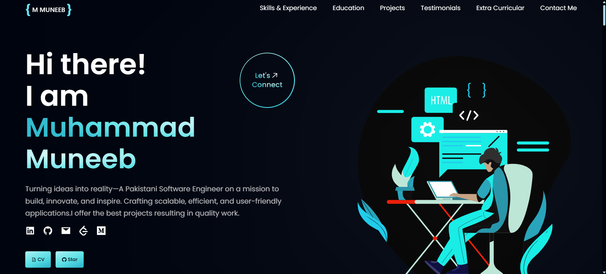

<h1 align="center"> Muhammad Muneeb — Personal Portfolio </h1>



### Deployed Links:

- [Netlify](https://your-netlify-link.netlify.app/)
- [Vercel](https://your-vercel-link.vercel.app/)

## Table of Contents 📁

1. [Tech Stack](#tech-stack-)
2. [Implemented Sections](#implemented-sections-%EF%B8%8F)
3. [Use as a theme](#using-as-a-theme-)
4. [Contributing](#contributing)
5. [Installation Guide](#installation-guide-)
6. [Sample Git Workflow](#sample-git-workflow)
7. [References & Inspirations](#references--inspirations-)
8. [Illustrations](#illustrations-%EF%B8%8F)

---

## Tech Stack 🧰

### Frameworks

- [ReactJS](https://reactjs.org/)
- [Tailwind CSS](https://tailwindcss.com/)

### Libraries / Tools

- [ViteJS](https://vitejs.dev/)
- [React Icons](https://react-icons.github.io/react-icons/)
- [Framer Motion](https://www.framer.com/)
- [React Lottie](https://www.npmjs.com/package/react-lottie)
- [Meraki UI](https://merakiui.com/components/)

---

## Implemented Sections ☑️

- Hero Section
- Skills & Experience
- Education
- Projects
- Blogs
- Open Source Contributions
- Extra Curricular
- Contact Me

---

## Using as a Theme ✨

You can customize this project for your own use. Key areas to update:

### 1. Personal Information

- Update `/src/constants/index.js` with your own data.
- Add or remove sections based on your need.
- Use [React Icons](https://react-icons.github.io/react-icons/) to update skills, contact links, etc.

### 2. Website Title & Favicon

- Edit `index.html` and change `<title>` and favicon link to your name and brand.

### 3. Assets

- Add your personal images to `/src/assets`
- Export them in `/src/assets/index.js`

---

## .env Configuration

To use features like GitHub contributions or email contact, create a `.env` file in the root folder:

```env
VITE_GH_TOKEN=your_token_here
VITE_EMAIL_SERVICE_ID=your_email_service
VITE_EMAIL_TEMPLATE_ID=your_template
VITE_EMAIL_USER_ID=your_user_id
```
